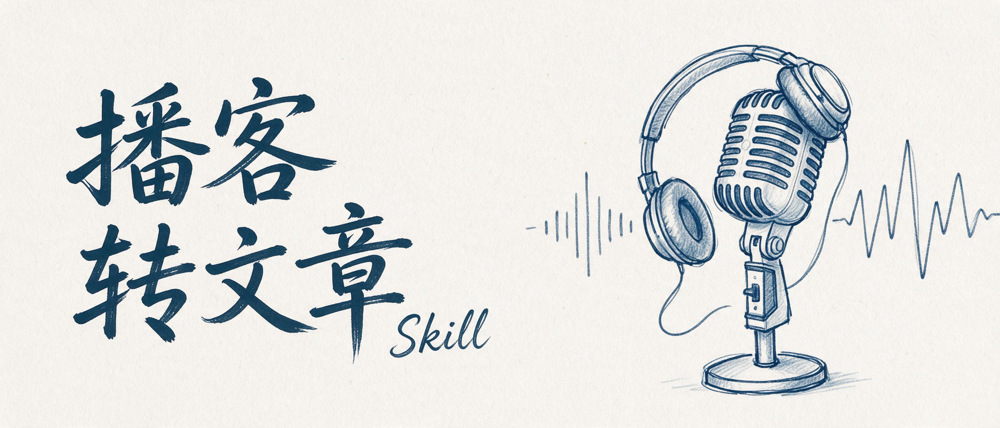

# podcast-to-article

Turn a podcast transcript into a publishable long-form article. Multi-speaker panels and single-guest interviews alike, in Chinese or English.

A transcript is organized around **who spoke and when**. An article is organized around **what the topic is and what the takeaway is**. This skill does that re-axis.



## The problem it solves

Ask a model to "write the transcript up as an article" and you get one of three failures. It keeps the relay structure ("Alice said… Bob said… Carol said…") and reads like meeting minutes. Or it abstracts everything away — no numbers, no product details, just smooth sentences carrying no new information. The third is hardest to spot: **over-rewriting**. The guest's own words get flattened into third-person summary, "he said" becomes a plain statement, and the piece reads like a reporter's second-hand account instead of a person talking.

The rules are therefore three-directional: **tear down the speaker scaffolding, keep the grain of the facts, keep the voice of the quotes.** And tearing down scaffolding only applies when several people are describing the same thing. In a single-guest interview the guest is the only source — there the rule flips, and you keep the original wording as intact as possible.

## Install

```bash
git clone https://github.com/orange2ai/podcast-to-article.git
ln -s "$(pwd)/podcast-to-article" ~/.cola/skills/podcast-to-article
```

`SKILL.md` is the agent-facing manual. No platform dependency — pure python3 standard library.

## Usage

```bash
python3 scripts/prep_transcript.py episode.srt -o cleaned.md   # strip timestamps, merge by speaker
python3 scripts/check_style.py draft.md                        # AI-tone self-check
```

Then ask your agent: *"turn this transcript into an article, Next Token style"*. It walks seven steps: clean → fact ledger → fix the through-line → re-axis into sections (quoting the original) → attribute names correctly → cut → self-check.

The checker also reports direct-quote share (10-28% for interview-style pieces) and the share of paragraphs that open with a self-contained assertion (keep it ≤30%).

Supports SRT, VTT, and pre-converted `.md` / `.txt` transcripts (including `**Speaker:**` markers).

## What's inside

```
SKILL.md                       the workflow and its criteria
references/style-rules.md      hard language rules, each with human/AI measured baselines
references/example.md          the same transcript passage, raw vs published
scripts/prep_transcript.py     transcript cleaner
scripts/check_style.py         draft checker
```

## Where the rules come from

The language numbers come from [lieflat-less-ai-tone](https://github.com/larashero3-dotcom/lieflat-less-ai-tone) (MIT): 300 model-generated articles plus 329 human-written ones — 629 articles, 95,551 sentences, 45,721 paragraphs. Three of its findings run against common advice: humans use **2.4x more** metaphors than models, humans use rhetorical questions **17x more** often in body text, and sentence-length evenness shows **no** difference.

The workflow and the name-attribution rules come from the real editing passes on the Next Token podcast (episode 004). "Keep the original wording" and "fix the through-line before writing" came from a second case: an 86-minute English interview (Noah Shinn of Instinct) whose first draft was 3,600 characters of topic-by-topic summary, zero direct quotes, every paragraph opening with an assertion — sent back three times before it was rebuilt around one through-line, with quotes restored.

## License

MIT
